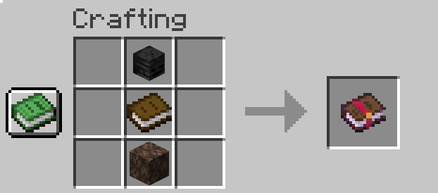

# Soulbound Mod

### Overview:
This mod adds an enchantment that keeps gear on death. You can obtain the enchantment through the following recipe:

### Config:
`damageSoulboundItems:` set this to `true` to deal a random percentage of damage to soulbound items after dying, between `minimumDamage` and `maximumDamage`.

`minimumDamage` and `maximumDamage`: values between 0 and 1.